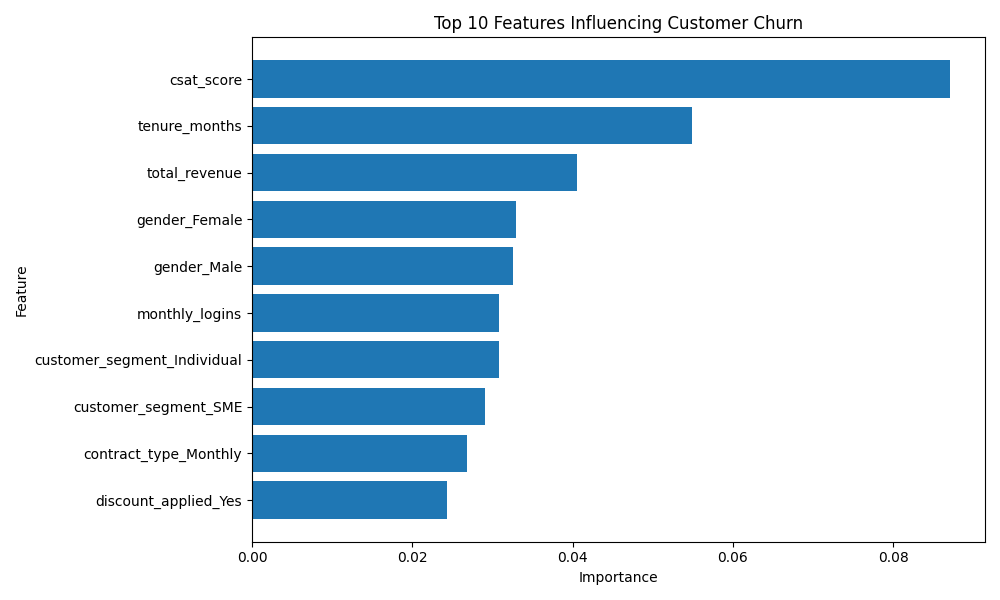

# AI-Powered Customer Churn Prediction System

An AI-powered customer churn prediction system built with **Python, Flask, HTML/CSS, and Machine Learning**. The system predicts the probability that a customer will leave a business and provides a web-based interface for evaluating individual customers.

## Project Overview

Customer churn is a major business challenge because losing existing customers can directly affect revenue and long-term growth.

This project develops a machine learning solution that analyzes customer information and predicts whether a customer is likely to churn. The prediction is integrated into a Flask web application, allowing users to enter customer information and receive a churn prediction and probability.

## Key Features

* Customer churn prediction using Machine Learning
* Random Forest classification model
* Neural Network model for comparison
* SMOTE to address class imbalance
* Probability-based churn prediction
* Adjustable prediction threshold
* Feature importance analysis
* Flask web application
* HTML/CSS user interface
* Business-oriented retention recommendation
* Model and feature-column serialization using Joblib

## Technologies Used

### Programming & Web Development

* Python
* Flask
* HTML
* CSS

### Machine Learning

* Scikit-learn
* Pandas
* NumPy
* Imbalanced-learn
* Random Forest
* Neural Network / MLP
* SMOTE
* Joblib

## Project Structure

```text
ai-customer-churn-prediction/
│
├── app.py
├── train_model.py
├── train_nn.py
├── model.pkl
├── columns.pkl
│
├── data/
│   └── customer_churn_business_dataset.csv
│
├── templates/
│   └── index.html
│
├── static/
│   ├── style.css
│   ├── customer_churn_summary.pdf
│   └── images/
│       └── feature_importance.png
│
└── README.md
```

## Machine Learning Approach

The dataset contains customer demographic, behavioral, financial, and service-related information.

The main workflow is:

```text
Customer Dataset
       ↓
Data Cleaning
       ↓
Feature Preparation
       ↓
Train/Test Split
       ↓
SMOTE for Class Imbalance
       ↓
Model Training
       ↓
Model Evaluation
       ↓
Probability Threshold Adjustment
       ↓
Flask Web Application
       ↓
Churn Prediction & Recommendation
```

### Data Preparation

The training process includes:

* Removing the `customer_id` identifier
* Handling missing values
* Encoding categorical variables using one-hot encoding
* Splitting the dataset into training and testing sets
* Applying SMOTE to improve learning from the minority churn class

A fixed `random_state=42` is used to make the experiments reproducible.

## Model Selection

Two machine learning approaches were evaluated:

### Random Forest

A Random Forest classifier was trained using multiple decision trees. It was selected for the final application because it provided useful churn detection performance and offered interpretable feature importance information.

### Neural Network

An MLP-based Neural Network was also tested as an alternative model.

The models were compared using classification metrics rather than relying only on overall accuracy. Particular attention was given to **recall for the churn class**, since failing to identify a customer who is likely to leave can be costly for a business.

## Model Results

The final Random Forest model achieved the following results using a prediction threshold of **0.25**:

| Metric          | Result |
| --------------- | -----: |
| Accuracy        | 80.83% |
| Churn Precision |    29% |
| Churn Recall    |    57% |

### Confusion Matrix

The final model produced:

```text
                    Predicted
                 Stay    Churn

Actual Stay      1192     233
Actual Churn       72      94
```

This means:

* **1,192** customers were correctly predicted to stay.
* **233** customers were incorrectly flagged as potential churn.
* **72** customers who churned were missed by the model.
* **94** customers who churned were correctly identified.

The prediction threshold was adjusted to make the system more sensitive to potential churn customers rather than optimizing only for overall accuracy.

## Feature Importance

The project also analyzes feature importance to identify which customer characteristics contribute most to the Random Forest predictions.



This helps connect the machine learning model with business interpretation and can provide insight into which customer behaviors or characteristics may be associated with churn.

## Web Application

The trained model is integrated into a Flask web application.

Users can enter customer information through the website, after which the application:

1. Processes the submitted customer information.
2. Applies the same feature structure used during model training.
3. Generates a churn probability.
4. Classifies the customer based on the selected threshold.
5. Provides a business-oriented recommendation.

For example, a customer with a sufficiently high predicted churn probability can be flagged for a potential retention action such as a support follow-up or retention discount.

## How to Run the Project

### 1. Clone the repository

```bash
git clone https://github.com/Bayarjarga1/ai-customer-churn-prediction.git
```

### 2. Open the project

```bash
cd ai-customer-churn-prediction
```

### 3. Install dependencies

```bash
pip install pandas scikit-learn flask joblib imbalanced-learn
```

### 4. Run the Flask application

```bash
python app.py
```

### 5. Open the application

Open the local address shown by Flask in your browser.

## Training the Model

To retrain the Random Forest model:

```bash
python train_model.py
```

To train the Neural Network model:

```bash
python train_nn.py
```

## Future Improvements

Possible future improvements include:

* Improving the precision of retention recommendations
* Reducing the number of required user inputs while maintaining prediction quality
* Testing additional machine learning algorithms
* Performing more extensive hyperparameter optimization
* Improving model explainability
* Adding customer-level explanations for predictions
* Connecting the system to a real customer database
* Deploying the application to a cloud platform
* Adding authentication and user management

## Project Purpose

This project demonstrates the practical application of **Machine Learning to a business problem**, combining data preprocessing, model development, evaluation, and web application development into a single end-to-end system.

### Skills Demonstrated

**Python · Machine Learning · Data Preprocessing · Classification · Random Forest · Neural Networks · SMOTE · Flask · HTML/CSS · Model Evaluation · Feature Engineering · Git/GitHub**